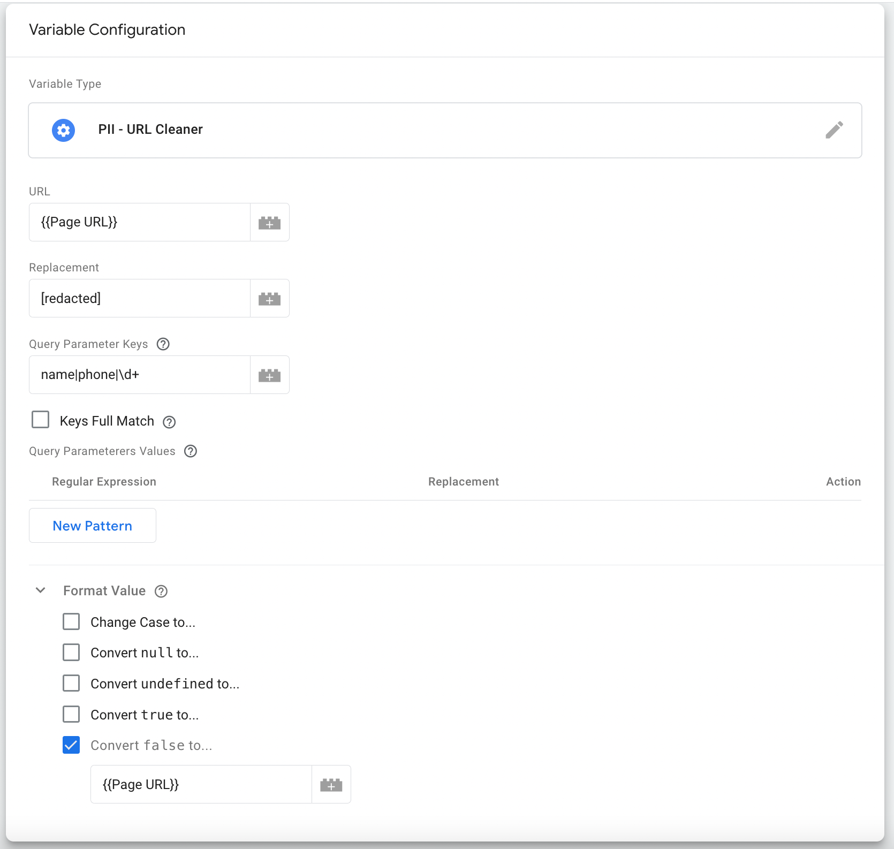

# Google Tag Manager 'PII - URL Cleaner' Variable Template

  

---

## Summary

This repository contains a [Google Tag Manager Variable template](https://developers.google.com/tag-manager/templates) that makes it possible to clean up URLs to remove any personally identifiable information (PII) before sending them to analytics or third-party platforms.

## Options

### URL
A URL to clean such as **{{Page URL}}** or **{{Referrer}}** (built-in variables), but you can redact other URLs as well.

### Replacement
Text that will overwrite the original content, by default `[redacted]`.

### Query Parameter Keys
List the query parameter keys to replace, separated by '|'. Each key will be treated as a regular expression. For example, entering `phone_` will redact any query parameter keys starting with `phone_`, such as `phone_main` and `phone_office`. To use exact matches instead of regular expressions, the `paramKeysFullMatch` checkbox should be enabled.

### Query Parameter Values
Query parameter values with dynamic or unknown keys can be redacted if the value matches a specified regular expression.

### Keys Full Match
By default, the keys are treated as regular expressions. For example, `phone_` will match all parameter keys starting with `phone_`, such as `phone_main` and `phone_office`. Check this box to disable regular expression matching and use exact key matching instead.

## Examples

### Example 1
**URL:**  
`https://example.com/?first_name=my first name&last_name=my last name&cellphone=123-456-7890&mainphone=000-000-000&10_Hash=My_Hash&foo=bar`    
**Replacement:** `[redacted]`  
**Query Parameter Keys:** `name|phone|\d+`  
**Full Match Keys**: Unchecked

Redacted URL:  
`https://example.com/?first_name=[redacted]&last_name=[redacted]&cellphone=[redacted]&mainphone=[redacted]&10_Hash=[redacted]&foo=bar`

Note that `foo` was not matched; therefore, the original value was retained.

### Example 2
**URL:**  
`https://example.com/?first_name=my first name&cellphone=123-456-7890&foo=bar`    
**Replacement:** `[redacted]`  
**Query Parameter Keys:** `first_name|phone`  
**Full Match Keys**: Checked

Redacted URL:  
`https://example.com/?first_name=[redacted]&cellphone=123-456-7890&&foo=bar`

Note that `phone` was not matched since the key is `cellphone`; therefore, the original value was retained.

## Tips
Make sure to default the `false` value to the initial input, in case any error happens during the replacement of the URL.

## Contributing
See our [contributing guidelines](CONTRIBUTING.md).
